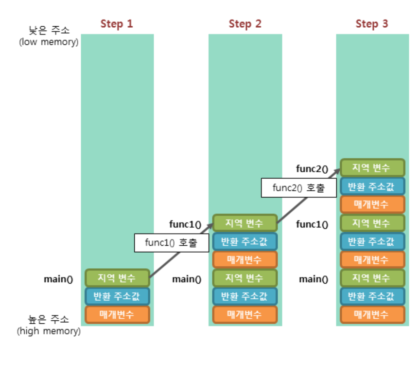

# 뱀파이어 서바이벌 장르 모작, 인프런

---

# Section 1. 유니티 기초

## 유니티 기초

- transform == gameObject.transform
- 게임오브젝트와 컴포넌트의 구조 개념
- 컴포넌트를 가져오는 방법
- 유니티에서 상속 개념
- GameObject에서 GetComponent로 가져오는 컴포넌트는 상속클래스 컴포넌트도 가져올 수 있다.

## 컨텐츠 기초 - 리소스 폴더 관리

- Sprites 리소스를 어떻게 관리 할 건지?
- 맵제작 - Sprite vs UI
- GameScene Manager
- Player Controller - 벡터
- Camera Controller

## 조이스틱

- UI_Joystick
- Player Controller

# Section 2. 오브젝트와 데이터

## 매니저

- Managers.cs
- Delegate, Action
- Player movement changed to delegate event

## Addressable

- Resource의 위치가 바뀌면 자동으로 Addressable의 path도 변경된다
- 폴더도 addressable로 추가 할 수 있다
- ResourceManager.cs
- Addressable은 비동기 방식으로 동작 → 결과는 콜백함수를 이용
- GameScene.cs Start()에서 모든 에셋을 불러옴. Resource.LoadAllAsync

## ObjectManager

- 콜백방식
- 

## PoolManager

## DataManager

# Section 3. 보석과 스킬

# Section 4. 보스와 AI

# Section 5. 마무리

# Section 6. 부록
